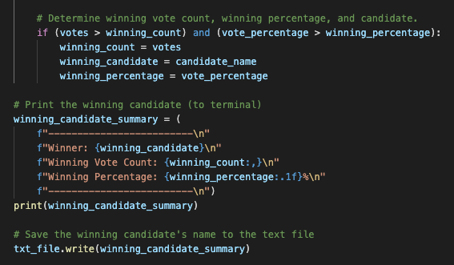

# Election Analysis

## Overview of Election Audit

We have been asked by the election commission to analyze a large dataset of election data to determine the voter turnout for each county, the percentage of votes for each county, and which county had the highest turnout. We will be adding this on to the already completed analysis of who actually won the election. We will be creating Python code that will extract the election data .csv and loop over all the rows in the dataset to determine the results for each county. We will then print the results to the console as well as write the results into a .txt file so that the analysis can be easily viewed by the election commission.

## Election Audit Results

[Link to Python Challenege code](https://github.com/SeanDraper/Election_Analysis/blob/main/PyPoll_Challenge.py)

In this section, we will lay out the results that were determined by our analysis as well as provide screenshots and snippets of code on how the analysis was conducted.

- How many votes were cast in this congressional election?

The total number of votes that were cast in the election was 369,711. As you can see in the above snippet, at the beginning of our For loop, we increased the number of total votes by 1. For each row that is looped, this total votes counter will increase which calculates the total number of votes cast in the election.

- Provide a breakdown of the number of votes and the percentage of total votes for each county in the precinct.

In the above image you can see the printed results for each county including the percentage each county cast along with the total votes each cast.

We created a loop to tabulate the results for each county. We first added each county to an array of counties. Then we counted how many votes each county received. After that we calculated the percentage of votes for each county. Then we created an f string so that the county results would be printed cleanly. We printed the results and wrote the results to a txt file. 

- Which county had the largest number of votes?

The country that cast the most votes was Denver with 82.8% of the votes and 306,055 cast. We calculated the winning county in the above snippet, and stored the winning county name, winning county count, and winning county percentage into variables. Then we created another f string to print the winning results and wrote them to a txt file.

- Provide a breakdown of the number of votes and the percentage of the total votes each candidate received.

In the screenshot above you can see the printed console output of the total number of votes and percentage that each candidate received.

The loop for candidates worked very simililarly to the loop for counties. We iterated over each row and added a vote to each candidate and then converted the votes to a percentage based on the total vote. We used an f string to format the results so that they could be printed and written.

- Which candidate won the election, what was their vote count, and what was their percentage of the total votes?

The candidate that won the election was Diana DeGette. She received 272,892 votes which was 73.8% of the vote. You can see the printed results in the screenshot above.

This portion of the candidate loop calculated the winner. After that we used an f string to format the results. Finally we printed the results to the console and wrote the results to a txt file.

## Election-Audit Summary

The Python code that we wrote for this election audit could be edited to be used in any election. The primary change that would need to be made is the input of the correct election dataset as a .csv file. The referenced name in the code would need to be changed accordingly. 

Right now, this code is analyzing county and candidate choice in its dataset, but other elections may want to collect other demographic information on the voter. We would be able to make modifications to the code and add additional loops to collect this specific demographic data and print and write it accordingly.

There are also several elections being held in the United States that use ranked choice to determine the winner. Voters would rank the candidates in order of preference rather than choosing a single candidate. In order to calculate the winner in a ranked choice election, we would give a weighted score to each rank. If there were 3 candidates, the candidate in the 1st position would receive three points, 2nd two points, and 3rd one point. We would then total the weighted scores and store them in a variable. This would all be done as we were looping through each row tallying the votes.